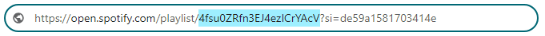
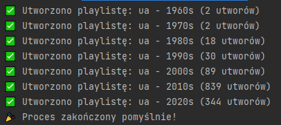
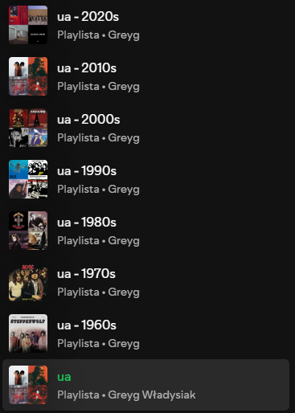

# Grouping Playlists by Decades on Spotify

An application that allows you to download a Spotify playlist, gather information about tracks (including release year), and create new playlists grouped by decades.

## Description

### Note: To make the script work, you must be the creator or co-creator of the playlist!

The application:

- Fetches data from a Spotify playlist, including track information.
- Attempts to retrieve the release year for each track based on the album.
- Groups tracks by decades (e.g., 1960s, 1970s, etc.).
- Creates new playlists for each decade, assigning tracks to the appropriate playlists.
- Creates a separate playlist for tracks without a specified release year (called "Unknown Decade").

## Requirements

To run the application, you need to meet a few requirements:

1. Clone this repository:
```bash
git clone https://github.com/Greyg12/SpotiApi.git
cd SpotiApi
```
2. Install Python version 3.6 or higher (if you don't already have it).
3. Install the required libraries:
    - `spotipy`
    - `pandas`
    - `numpy`
    - `python-dotenv`
    
   You can install them using the following command:

   ```bash
   pip install spotipy pandas numpy python-dotenv
   ```
4. 🔧 Register an application at https://developer.spotify.com/dashboard
   Click "Create an App"

   Set:

   Name (any name)

   Description (e.g., “Decade Playlist Analyzer”)

   Add a redirect URI, e.g.:

   http://localhost:8888/callback
   (This must match exactly with the URI in the `.env` file and the code.)

5. Create a `.env` file in the project's root directory and fill it with your Spotify credentials:

   To allow the application to connect to the Spotify API, you need to create a `.env` file in the application's root directory.  
   The file should contain the following variables:

   ```env
   SPOTIPY_CLIENT_ID=your_client_id
   SPOTIPY_CLIENT_SECRET=your_client_secret
   SPOTIPY_REDIRECT_URI=your_redirect_uri
   ```


## Running the Application

1. **Update the Playlist ID** in the `.py` file:
   
   Open the script and find the line:

   ```python
   playlist_id = '4fsu0ZRfn3EJ4ezICrYAcV'
   ```

   Use the highlighted part of the link in the `playlist_id` variable.
   
 
2. **Run the Script**
   
   main.py
3. **Log in to Spotify:**

   On the first run, a browser window will open asking you to log in and authorize the application.
4. **Wait for Completion:**

   For larger playlists, the script may take a few minutes to complete.

   The script will fetch data, group it by decades, and create new playlists in your Spotify profile. Each playlist will have a name in the format:

   Original Playlist Name - 1990s  
   Original Playlist Name - 2000s  
   etc.  

   At the end, you will see the message:

   🎉 Process completed successfully!

   


## Application Workflow:

   Fetching the playlist – The application fetches the playlist based on the provided `playlist_id`.

   Grouping tracks – Tracks in the playlist are grouped by decades. If a track's year is unavailable, it will be assigned to the "Unknown Decade" group.

   Creating playlists – Based on the decade groups, new playlists are created containing the appropriate tracks.

## Example

   If you have a playlist containing tracks from various years, the application will automatically group them as follows:

   ua - 1960s  

   ua - 1970s  

   ua - 1980s  

   etc.  

   ua - Unknown Decade (for tracks without a release year)

   Each of these playlists will contain the appropriate tracks grouped by decades.

